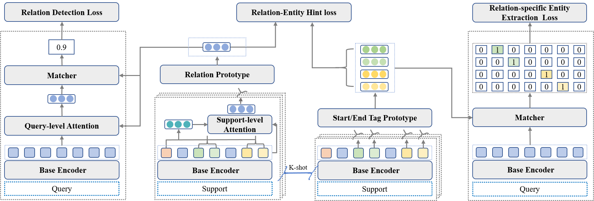

Relation-Guided Few-Shot Relational Triple Extraction
===

This code is for SIGIR 2022 short paper "Relation-Guided Few-Shot Relational Triple Extraction".

Overview
---



In this work, we propose a novel task decomposition strategy, Relation-then-Entity, for FS-RTE. It first detects relations occurred in a sentence and then extracts the corresponding head/tail entities of the detected relations. To instantiate this strategy, we further propose a model, RelATE, which builds a dual-level attention to aggregate relation-relevant information to detect the relation occurrence and utilizes the annotated samples of the detected relations to extract the corresponding head/tail entities. Experimental results show that our model outperforms previous work by an absolute gain (18.98%, 28.85% in F1 in two few-shot settings).

You can find the paper in `paper` directory or download it from [here](https://doi.acm.org/?doi=3477495.3531831).

Requirements
---

```
pytorch=1.7.1
cudatoolkit=10.2
transformers=3.5.1
gitpython=3.1.11
```

**NOTE**: Different versions of packages (such as `pytorch`, `transformers`, etc.) may lead to different results from the paper. However, the trend should still hold no matter what versions of packages you use.

Usage
---

1. Training model

```shell
python main.py
```

After training, this script will evaluate the model automatically. The best model will be saved in `checkpoint` directory. 

All hyper-parameters are listed in `config.py` file. You can change it to conduct more experiments.

2. Evaluation

```shell
python main.py --model=relate --trainN=5 --evalN=5 --K=5 --Q=1 --load_ckpt="your_checkpoint_name_saved_in_checkpoint_dir" --test
```

Citation
---

```
@inproceedings{cong2022RelATE,
 author = {Cong, Xin and Sheng, Jiawei and Cui, Shiyao and Yu, Bowen and Liu, Tingwen and Wang, Bin},
 booktitle = {Proc. of SIGIR},
 title = {Relation-Guided Few-Shot Relational Triple Extraction},
 year = {2022}
}
```
